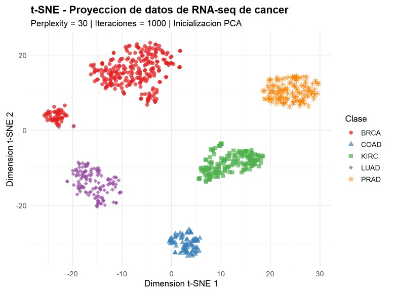
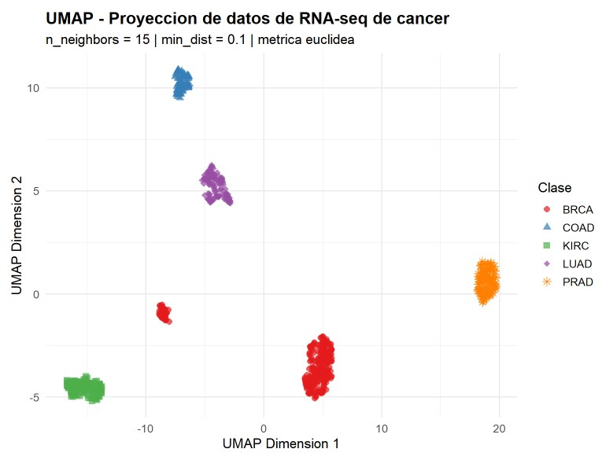
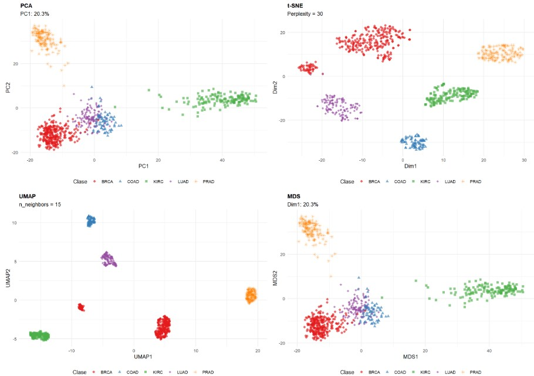
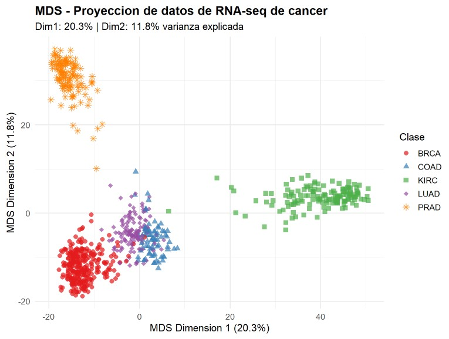
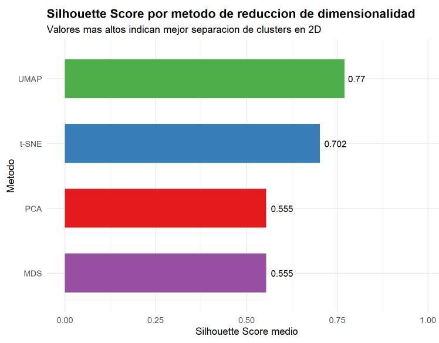

# RNA-Seq Unsupervised Learning - Cancer Type Classification

[](https://www.r-project.org/)
[](https://github.com/CarenMoreno/RNA-Seq-Unsupervised-Learning)
[](https://www.cancer.gov/tcga)
[](https://github.com/CarenMoreno/RNA-Seq-Unsupervised-Learning)

> **Master's in Bioinformatics - UNIR | Algorithms & Artificial Intelligence**  
> Unsupervised machine learning applied to RNA-seq cancer gene expression data (TCGA)

---

## Overview

This project applies four unsupervised dimensionality reduction techniques to a gene expression dataset from **The Cancer Genome Atlas (TCGA)**, comprising **801 patient samples** across **5 cancer types** and **20,531 genes**. The goal is to explore whether transcriptomic profiles alone can reveal biologically meaningful groupings without using any class labels during analysis.

<p align="center">
  
</p>

### Cancer Types Analyzed

| Code | Full Name | Samples |
|------|-----------|---------|
| BRCA | Breast Invasive Carcinoma | ~300 |
| KIRC | Kidney Renal Clear Cell Carcinoma | ~144 |
| COAD | Colon Adenocarcinoma | ~78 |
| LUAD | Lung Adenocarcinoma | ~141 |
| PRAD | Prostate Adenocarcinoma | ~136 |
---

## Repository Structure

```
RNA-Seq-Unsupervised-Learning/
│
├── README.md                          # This file
├── actividad1_caren.Rmd               # Full annotated R Markdown analysis
│
├── scripts/
│   └── rna_seq_unsupervised_analysis.Rmd
│
├── results/
│   └── rna_seq_unsupervised_analysis.html
│
├── images/                            # All figures generated by the analysis
│   ├── fig1_pca.png                   # PCA projection
│   ├── fig2_tsne.png                  # t-SNE projection
│   ├── fig3_umap.png                  # UMAP projection
│   ├── fig4_tsne_stability.png        # t-SNE stability analysis
│   ├── fig5_mds.png                   # MDS projection
│   └── fig6_silhouette.png            # Silhouette Score comparison
│
└── data/                              # (not included - see Data section below)
    ├── data_complete.csv              # 801 × 20531 gene expression matrix
    └── labels.csv                     # Sample IDs and cancer type labels
```

---
## Methods

Four complementary approaches were implemented and compared:

| Method | Type | Key Parameters |
|--------|------|----------------|
| **PCA** | Linear | `center=TRUE`, `scale=TRUE` |
| **t-SNE** | Non-linear | `perplexity=30`, `max_iter=1000`, `pca=TRUE` |
| **UMAP** | Non-linear | `n_neighbors=15`, `min_dist=0.1`, `metric=euclidean` |
| **MDS** | Linear (distance-based) | `k=2`, `method=euclidean` |

---

## Results

### Figure 1 - PCA: Principal Component Analysis

PC1 explains **~20% of variance** and clearly separates KIRC from the remaining cancer types. This is biologically consistent with the distinct transcriptomic signature of renal clear cell carcinoma, driven by VHL loss-of-function and hypoxia pathways.


---

### Figure 2 - t-SNE: Non-linear Embedding

t-SNE reveals compact, well-separated clusters for each cancer type, capturing non-linear relationships that PCA misses. KIRC, COAD, and BRCA are especially well-isolated.



---

### Figure 3 - UMAP: Uniform Manifold Approximation and Projection

UMAP achieves the clearest separation of all five cancer types while also preserving global structure. Notably, LUAD and COAD appear proximal - consistent with their shared glandular epithelial origin.



---

### Figure 4 - t-SNE Stability Analysis

Stability assessment across multiple random seeds confirms that the cluster structure identified by t-SNE is reproducible and not an artifact of initialization.



---

### Figure 5 - MDS: Multidimensional Scaling

MDS with Euclidean distance produces results equivalent to PCA (mathematically identical when using this metric), confirming the linear structure of the dataset. Dimension 1 explains **20.27%** of variance, Dimension 2 explains **11.77%**.



---

### Figure 6 - Silhouette Score Comparison

Quantitative evaluation using **Silhouette Score** (range −1 to +1, higher = better cluster separation):

| Method | Silhouette Score | Type | Speed | Interpretability |
|--------|-----------------|------|-------|-----------------|
| **UMAP** | **0.7704** | Non-linear | Fast | Medium |
| **t-SNE** | 0.7024 | Non-linear | Moderate | Low |
| **PCA** | 0.5547 | Linear | Very fast | High |
| **MDS** | 0.5547 | Linear | Moderate | High |



**UMAP achieved the highest Silhouette Score (0.7704)**, making it the most effective method for separating cancer types in 2D space on this dataset.

---

## Data Preprocessing Pipeline

```
Raw data (801 samples × 20,531 genes)
         │
         ▼
Remove zero-variance genes → 20,264 genes remaining
         │
         ▼
Select top 2,000 genes by variance (standard RNA-seq practice)
         │
         ▼
Z-score scaling per gene (mean=0, sd=1)
         │
         ▼
Apply dimensionality reduction (PCA / t-SNE / UMAP / MDS)
```

**Key preprocessing decisions:**
- **267 zero-variance genes** removed (uninformative, cause numerical errors)
- **Top 2,000 variable genes** selected - standard in RNA-seq; high-variance genes are most biologically informative
- **Z-score normalization** applied to correct for different expression ranges across genes
- **Class imbalance noted** (BRCA ~300 vs COAD ~78 samples) - relevant for result interpretation

---

## How to Reproduce

### Requirements

```r
install.packages(c("ggplot2", "dplyr", "Rtsne", "umap",
                   "factoextra", "cluster", "gridExtra", "RColorBrewer"))
```

### Steps

1. Clone this repository
   ```bash
   git clone https://github.com/CarenMoreno/RNA-Seq-Unsupervised-Learning.git
   cd RNA-Seq-Unsupervised-Learning
   ```

2. Download the TCGA RNA-seq data and place `data_complete.csv` and `labels.csv` inside a `data/` folder (or adjust the paths in the `.Rmd` file)

3. Open `actividad1_caren.Rmd` in RStudio

4. Update the working directory path in the `setup` chunk:
   ```r
   knitr::opts_knit$set(root.dir = "your/path/to/data/folder")
   ```

5. Click **Knit → Knit to HTML**

> **Note:** The MDS step computes an 801×801 distance matrix and may take 1–2 minutes. t-SNE with 1000 iterations takes approximately 2–3 minutes on a standard laptop.

---

## Key Biological Insights

- **KIRC is the most transcriptomically distinct** cancer type in this cohort - consistent with its unique molecular biology (VHL mutations, hypoxia signaling, lipid metabolism reprogramming)
- **LUAD and COAD show transcriptomic proximity** in UMAP space, reflecting their shared glandular epithelial origins despite arising in different organs
- **Non-linear methods (UMAP, t-SNE) dramatically outperform linear methods** (PCA, MDS) in separating cancer types in 2D - Silhouette Score improvement of ~39% (0.55 → 0.77)
- The clean cluster separation achieved **without using labels** demonstrates that RNA-seq profiles contain sufficient information for cancer subtype identification

---

## Tools & Libraries

| Tool | Version | Purpose |
|------|---------|---------|
| R | ≥ 4.0 | Primary analysis language |
| ggplot2 | ≥ 3.4 | Data visualization |
| Rtsne | ≥ 0.16 | t-SNE implementation |
| umap | ≥ 0.2.10 | UMAP implementation |
| cluster | ≥ 2.1 | Silhouette Score evaluation |
| RColorBrewer | ≥ 1.1 | Color palettes |
| factoextra | ≥ 1.0.7 | PCA visualization |
| gridExtra | ≥ 2.3 | Multi-panel figure layout |

---

## Author

This analysis was completed as part of the **Algorithms & Artificial Intelligence** course in the Master's program in Bioinformatics at UNIR (Universidad Internacional de La Rioja).

**Author:** Caren Moreno  
**Program:** Máster en Bioinformática - UNIR  
**Year:** 2026  

---

*Part of my bioinformatics portfolio. See also: [metagenomic-analysis-qiime2](https://github.com/CarenMoreno/metagenomic-analysis-qiime2) | [RNAseq-obesity-simpsons](https://github.com/CarenMoreno/RNAseq-obesity-simpsons)*

## License
This project is distributed under the GPL-3.0 License
